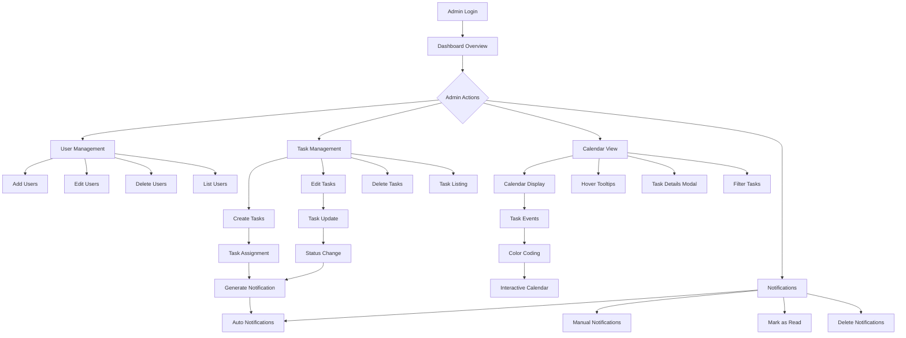
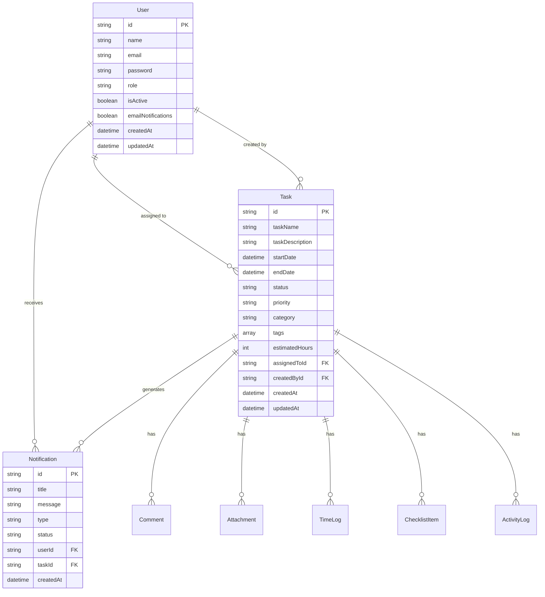
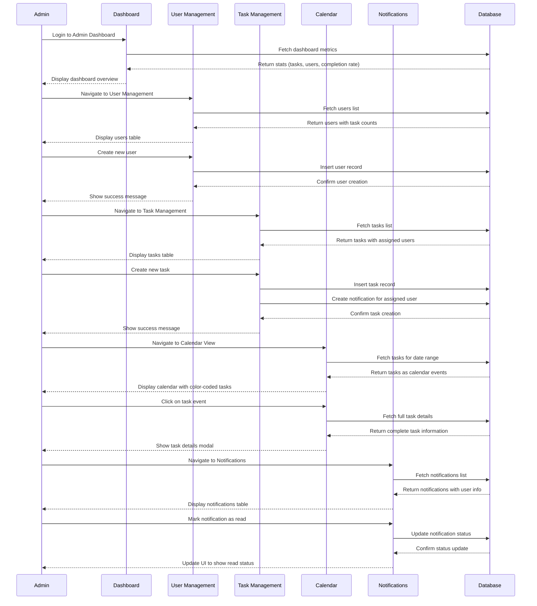
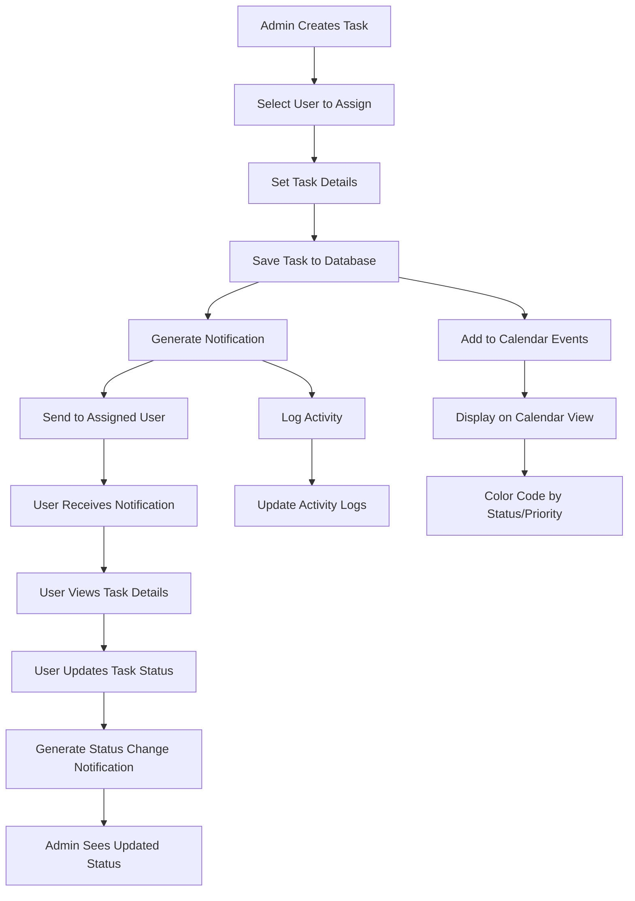
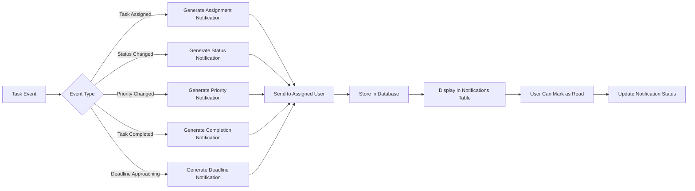
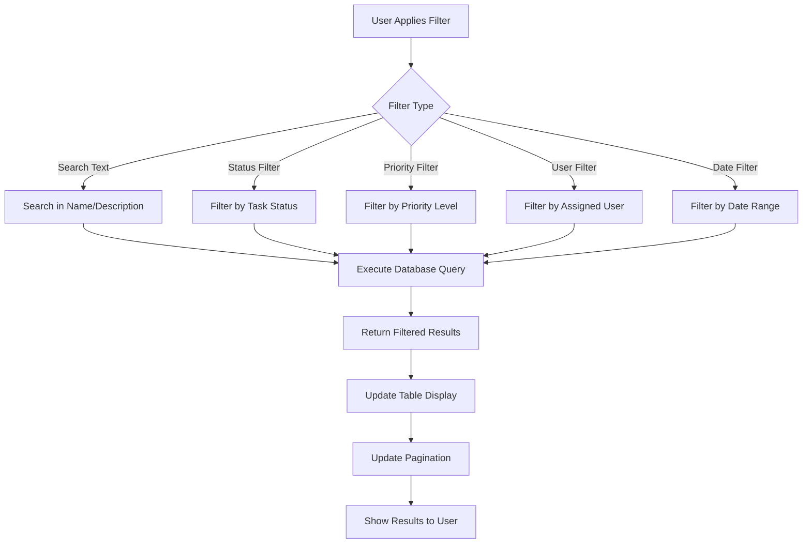
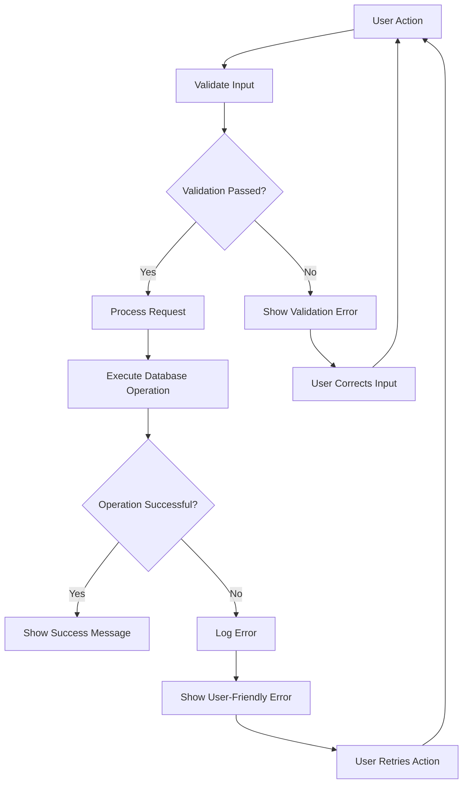

# Admin Dashboard Workflow Diagram

## System Architecture Flow

## Database Relationships

## User Interaction Flow

## Task Assignment Workflow

## Notification System Flow

## Filtering and Search Flow

## Error Handling Flow

This comprehensive workflow documentation provides a complete overview of the Admin Dashboard MVP system, including user interactions, data flow, error handling, and system architecture.
